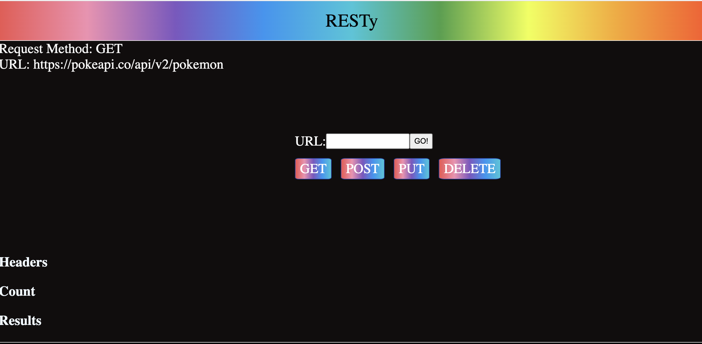

Author:  Ashwini Uppal

RESTy API testing application.

Our application will be an API testing tool that can be run in any browser, allowing a user to easily interact with APIs in a familiar interface.

The core requirements and functionality are as follows:

Simple, intuitive user interface
An output section that displays the results of the API call
A form that allows the user to enter the URL of the API and the HTTP method to use

[Render](https://resty-ychn.onrender.com)