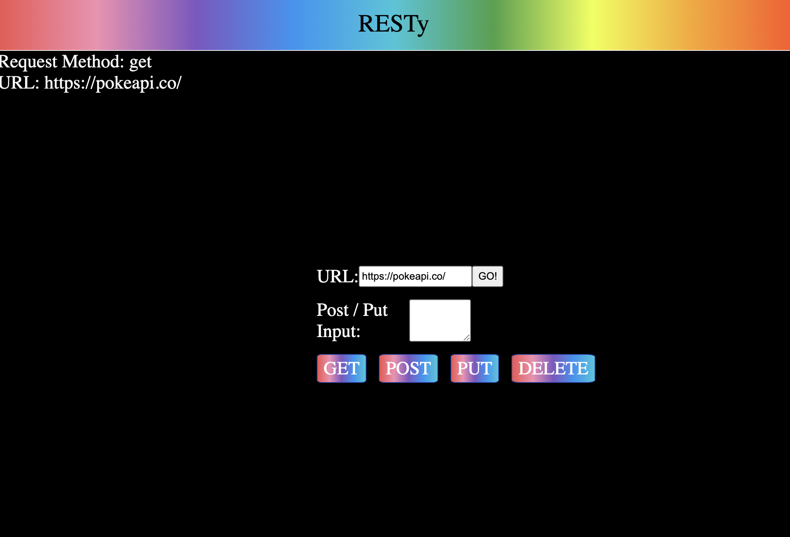
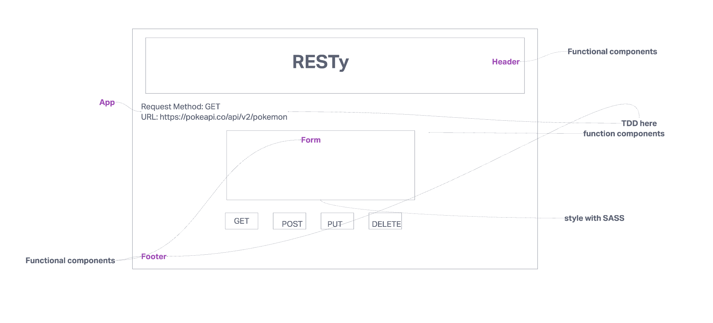

Author:  Ashwini Uppal

RESTy API testing application.

Our application will be an API testing tool that can be run in any browser, allowing a user to easily interact with APIs in a familiar interface.

The core requirements and functionality are as follows:

Simple, intuitive user interface
An output section that displays the results of the API call
A form that allows the user to enter the URL of the API and the HTTP method to use

[codeSandbox](https://codesandbox.io/p/github/ashuppal/resty/state?workspaceId=298292ae-8d28-427b-b58b-990beefc264a&file=%2FREADME.md&selection=%5B%7B%22endColumn%22%3A1%2C%22endLineNumber%22%3A11%2C%22startColumn%22%3A1%2C%22startLineNumber%22%3A11%7D%5D)